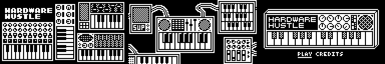

# Hardware Hustle


Hardware Hustle is a tabletop, roll-and-write resource management game about sustainably running an indie electronics business.

Buy, make, sell, and research your way to profit without burning out!

_For one or more players. Ages 10+. ~20min to play._

## Development notes

**Open beta testing:** Format, mechanics, and features are set; copy and design can change.

- Long ago, I drafted pixel art for a video game of the same name and concept. This paper version is like what I had in mind but boiled down to the bare math.  
  
- In the tradeoff between complexity and accessibility, this game errs towards the latter. I want it to be fast and easy to play solo. There were lots of "It would be cool if" type features that were abandoned.
- Part/Widget names are ~temporary and their icons are stock.
- An “electronic dice” soldering kit would would make a great companion. I've done some breadboard research and it's very doable and fun.

## To play

### Print instructions

Download the latest PDFs from [https://oskitone.github.io/hardware_hustle/](https://oskitone.github.io/hardware_hustle/)

- Game sheets
  - Choose layout for either letter or legal paper size; design is identical but legal is better because you get two game sheets per paper
  - Print portrait mode without margins, at 100% scale, and single-sided
  - Trim individual game sheets to 8"x6"
  - For a nice finish, bind a stack of them to cardboard backing with bookbinding glue
- Rules
  - Print portrait mode without margins, at 100% scale, and double-sided (flip on long edge)
  - Cut horizontally to 8.5"x5.5"
  - Fold and staple into a 4.25"x5.5" zine booklet; see corner numbers for page order

### Playtester feedback welcome

As it is in real life, the Hardware Hustle is not for everyone. I had one early playtester tell me its format and rules were so complicated it's basically unplayable (the rules have since been completely rewritten). Another said its format is so straightforward that it doesn't need rules. Who knows, you know?

Even still, your constructive feedback is welcome. Please earnestly play at least one entire game before telling me what you think. I'm especially open to feedback on how to make the rules easier to understand.

**Feedback form:** [https://forms.gle/SubELmMXAjzLFNcR7](https://forms.gle/SubELmMXAjzLFNcR7)

## Changelog

* **prototype_draft_00d1aae_240124**
  * shared opportunity rolls
  * continue reading for ~confusing research
  * roll-and-write is every phase
  * misc formatting/readability nits
* **prototype_draft_dcb37bc_240104**
  * init

## Source code

Believe it or not, this game is a [Next.js](https://nextjs.org/) website optimized for print.

To run:

```bash
npm i
npm run dev
```

Then open [http://localhost:3000](http://localhost:3000) in Chrome. (Note that, despite _kind of_ working, it's not designed to be played on a screen and will have display oddities in non-Chrome browsers.)

If you're <del>on a Mac</del> me on my laptop, to make PDFs:

```bash
./make_pdfs.sh
```

## Playtester thanks

Leia M, Paul S, Kris K, Kirk P, Erica S, Donald, Fred, Garrick, Jason D; you?

## License

Tentatively `CC BY-SA 4.0` but TBD

Draft icons are BoxIcons (`CC 4.0`) and Ionicons (`MIT`)