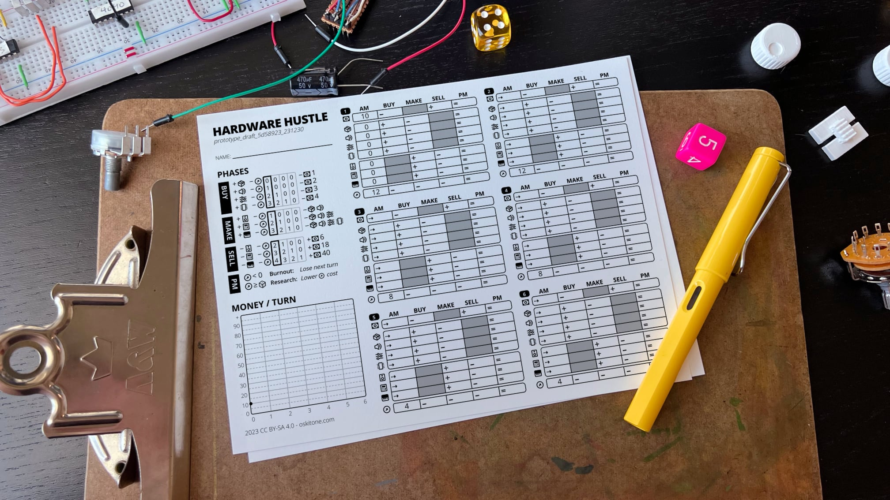

# Hardware Hustle



Hardware Hustle is a roll-and-write resource management game for one or more players about sustainably running a small hardware business. It's a tabletop game disguised as a spreadsheet that you print out and play!

Buy, make, sell, and research your way to profit without burning out!

## Development notes

**Open beta testing:** Format, mechanics, and features are set; copy and design can change.

- Long ago, I drafted pixel art for a video game of the same name and concept. This paper version is like what I had in mind but boiled down to the bare math.  
  
- In the tradeoff between complexity and accessibility, this game errs towards the latter. I want it to be fast and easy to play solo. There were lots of "It would be cool if" type features that were abandoned.
- Part/Widget names are temporary and their icons are stock.
- A couple playtesters have said the rules are presented too difficultly. I'm working on it!
- An “electronic dice” soldering kit would would make a great companion. I've done some breadboard research and it's very doable and fun.

## To play

### Print instructions

Download the latest PDFs from [https://oskitone.github.io/hardware_hustle/](https://oskitone.github.io/hardware_hustle/)

- Game sheets
  - Choose layout for either letter or legal paper size; design is identical
  - Print portrait mode without margins, at 100% scale, and single-sided
  - Trim individual game sheets to 8"x6"
  - For a nice finish, bind a stack of them to cardboard backing with bookbinding glue
- Rules
  - Print landscape mode without margins, at 100% scale, and double-sided (flip on short edge)
  - Trim to 7.5"x11"
  - Fold into a booklet
- Roll table
  - Print landscape mode without margins, at 100% scale, and double-sided (flip on short edge)
  - Trim to 7.5"x5.5"
  - Use cardstock for better reusability

### Playtester feedback welcome

Hardware Hustle is not for everyone. I had one playtester tell me its format and rules were so complicated it's basically unplayable. Another said its format is so straightforward it doesn't need rules!

Whatever the case, your constructive feedback is welcome. Please play at least one entire game before submitting. [https://forms.gle/SubELmMXAjzLFNcR7](https://forms.gle/SubELmMXAjzLFNcR7)

## Source code

Believe it or not, this game is a website optimized for print.

To run:

```bash
npm i
npm run dev
```

Then open [http://localhost:3000](http://localhost:3000) in Chrome. (Note that, despite _kind of_ working, it's not designed to be played on a screen and will have display oddities in non-Chrome browsers.)

If you're on a Mac, to make PDFs:

```bash
./make_pdfs.sh
```

## Playtester thanks

Leia M, Paul S, Kris K, Kirk P, Erica S

## License

Tentatively `CC BY-SA 4.0` but TBD
