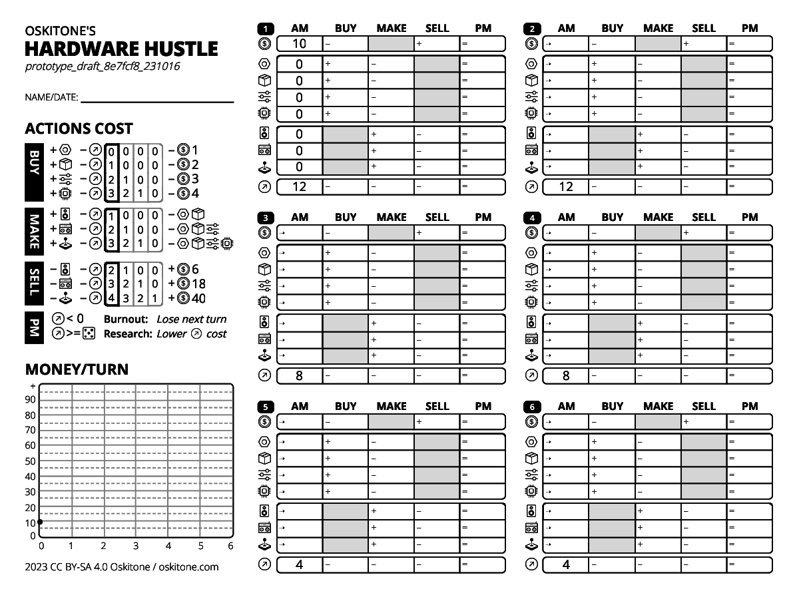

import classnames from "classnames";

import styles from "@/styles/Rules.module.css";

import { ID_TITLE } from "components/sidebar";
import PhasesTable, { ACTIONS } from "components/phases-table";
import Icon, {
  Money,
  Opportunity,
  A,
  B,
  C,
  D,
  AB,
  ABC,
  ABCD,
  Roll,
  MoneyX,
  OpportunityX,
  AX,
  BX,
  CX,
  DX,
  ABX,
  ABCX,
  ABCDX,
  RollX,
  IconsParen
} from "components/icon";
import Turn, { ExampleCell, firstTurnSuppliedColumns } from "components/turn";
import Wordmark from "components/wordmark";

<Wordmark className={styles.Wordmark} wrap={true} draftId={props.draftId} />

{/* TODO: standardize "the total <Opportunity /> they cost" language. Consumed? Used? */}

# Rules

## Introduction

Hardware Hustle is a tabletop, roll-and-write resource management game about sustainably running a small hardware business.

For 1+ players. Ages 10+. ~20min to play.

## Game Overview

Your goal is to profit without burning out. You have six turns to buy parts to make widgets, make widgets from parts, sell widgets for money to buy more parts, and so on.

Each of those phases takes opportunity <IconsParen ids={["opportunity"]} />, which depletes as the game progresses and is limited per-phase by a die roll. At the end of each turn, you can attempt a research upgrade to reduce future <Opportunity /> costs.

The six turns are miniature spreadsheets, and the game ends when they're all filled out. The player at the end with the most money wins.

## Components

Each player will need:

- Hardware Hustle game sheet
- Six-sided die or "Roll Table" page in rules (see appendix for usage)
- Calculator or scratch paper for math (optional)

## Game Setup

Fill out the "{ID_TITLE}" line in the top left of the game sheet, then familiarize yourself with the rest of its layout: Phases table, Money/Turn graph, and six turn spreadsheets.

There is no player order, game sheets are filled out simultaneously, and die rolls can be done by any player.

## How to Play

The spreadsheet's rows are grouped into money <IconsParen ids={["money"]} />, parts <IconsParen ids={["A", "B", "C", "D"]} />, widgets <IconsParen ids={["AB", "ABC", "ABCD"]} />, and opportunity <IconsParen ids={["opportunity"]} />.

And its five columns are phases that you fill out from left to right during your turn.

1. ### AM
   Take stock of what you have and need
1. ### Buy
   Buy parts <IconsParen ids={["A", "B", "C", "D"]} /> using <Money /> and <Opportunity />
1. ### Make
   Make widgets <IconsParen ids={["AB", "ABC", "ABCD"]} /> using parts and <Opportunity />
1. ### Sell
   Sell widgets for <Money /> using <Opportunity />
1. ### PM
   Use remaining <Opportunity /> to research or lose next turn if <Opportunity /> is negative

{/* TODO: try pulling these to front. */}
(Refer to the *Example Turn* towards the end of the rules for a glimpse of everything in action and an *Icon Glossary* that says what the icons are called.)

### 1. AM

You begin each turn by taking stock of what you have and need at the beginning of the day.

For the game's first turn, there's nothing to do here besides note the starting pre-filled values. You have <MoneyX value={10}/> and <OpportunityX value={12}/>... and you need basically everything else.

(Later turns will have empty cells to fill out, but there still won't be any decision-making. For that reason, AM is not listed in the Phases table on the left of your game sheet.)

### 2. Buy

Before you can make any money selling widgets, you've got to spend money to buy their parts.

Parts cost <Money /> and <Opportunity />, as listed in the Phases table:

<PhasesTable phases={[ACTIONS.BUY]} className={styles.PhasesTable} />

The <Opportunity /> costs are a table of values, but, for all the phases of your first turn, you'll only use the ones in the leftmost column with the dark outline. To buy a <A suffix={","} /> you need <OpportunityX value={0} /> and <MoneyX value={1} />; to buy a <B /> you need <OpportunityX value={1} /> and <MoneyX value={2} />; etc. You'll revisit <Opportunity /> costs in the PM phase a little later.

To complete the Buy phase:

1. **Roll:**
    * Roll a die. Its value is the _maximum_ <Opportunity /> that each player can spend buying this turn.
    * Based on the max <Opportunity /> that was just rolled and how much <Money /> you have in the AM column, decide which parts to buy.
1. **Write:** In the Buy column, write the values for the total <Money /> cost, the parts you bought, and the total <Opportunity /> they used.

Notes:

- The value of the <Opportunity /> roll is shared by all players, and everyone fills in their game sheets simultaneously.
- You can buy as many or as few parts as you want and even multiples of the same part, as long as you have the required <Opportunity /> and <Money />. (The sum <Opportunity /> must be less than or equal to your roll, and the sum <Money /> must be less than or equal to what you have in the AM column.)
- You can also choose to buy nothing and skip this phase, though that's a gutsy move on your first turn!
- Cells are prefixed by their mathematical operation. You're losing <Money /> and <Opportunity />, so those cells have a **-**. You're gaining parts, so they have a **+**. The same **-**/**+** signs are in the Phases table.
- Unused cells have a gray background to mark they're skipped.
- Cells with no change can be crossed out or filled with 0.
- You can spend less <Opportunity /> than you roll, but you can't spend more. You also can't spend more <Money /> than you have available.
- Don't move on to the next phase until everyone's completed the current one.

### 3. Make

Now you'll use the parts you bought to make widgets you can sell.

The Phases table lists the widgets you can make, their outlined <Opportunity /> costs, and the parts they'll use:

<PhasesTable phases={[ACTIONS.MAKE]} className={styles.PhasesTable} />

To complete the Make phase:

1. **Roll:**
    * Roll a die. Its value is the _maximum_ <Opportunity /> that each player can spend making this turn.
    * Based on the max <Opportunity /> that was just rolled and which parts you have available, decide which widgets to make.
1. **Write:** In the Make column, write the values for the parts you used, the widgets you made, and the total <Opportunity /> they used.

You can make as many or as few widgets as you want, provided you have the required parts and <Opportunity />. In later turns, you can use parts purchased in previous turns.

### 4. Sell

{/* TODO: no/fewer "note"s */}

If you made any widgets, now's a fine time to sell them so you have <Money /> for your next turn's Buy phase.

Notice how the Phases table for Sell has you losing widgets but gaining <Money />:

<PhasesTable phases={[ACTIONS.SELL]} className={styles.PhasesTable} />

To complete the Sell phase:

1. **Roll:**
    * Roll a die. Its value is the _maximum_ <Opportunity /> that each player can spend selling this turn.
    * Based on the max <Opportunity /> that was just rolled and which widgets you have available, decide which widgets to sell.
1. **Write:** In the Sell column, write the values for the <Money /> you made, the widgets you sold, and the total <Opportunity /> they used.

Sell as many or as few widgets as you want, provided you have the required widgets and <Opportunity />. In later turns, you can sell widgets made in previous turns.

### 5. PM

Whew! It's time to wrap up the workday and end your turn.

To complete the PM phase:

1. **Roll:**
    1. Roll a die. Its value is the _minimum_ <Opportunity /> you need remaining to upgrade _one_ of the previous three phases' actions. See below for more info.
1. **Write:**
    * Tally each row's equation into the final column prefixed with **=**.
    * If your remaining <Opportunity /> is negative, you suffer **burnout** and cross out the entire next turn to rest. Again, see below for more info.

The Phases table summarizes PM's <Opportunity /> resolution:

<PhasesTable phases={[ACTIONS.PM]} className={styles.PhasesTable} />

#### Burnout

You've spent more <Opportunity /> than you had available and have to spend the whole next day recuperating. Hope it was worth it.

Cross out the entire next turn's spreadsheet. You cannot do any of its phases.

#### Research Upgrade

Is your remaining <Opportunity /> greater than or equal to the <Opportunity /> roll? Nice! Your research succeeded. Circle the PM column's <Opportunity /> cell to mark its success; otherwise cross it out for failure:

<table>
  <tbody>
    <tr>
      <th>Success: &nbsp;</th>
      <td><ExampleCell success value={5} /></td>
    </tr>
    <tr>
      <th>Failure: &nbsp;</th>
      <td><ExampleCell fail value={2} /></td>
    </tr>
  </tbody>
</table>

Recall how you've only been using the first column of <Opportunity /> values with the dark outline in the Phases table. If your research upgrade was successful, choose _one_ phase action (Buy, Make, or Sell) to spend it on, then shade in its outlined column and outline the next values to its right.

As an example, here's what it would look like after a successful research upgrade to Make:

<PhasesTable className={styles.PhasesTable} selectedIndexes={[0, 1, 0]} />

Everything in Make is now <OpportunityX value={1} /> cheaper. The non-researched action's <Opportunity /> costs in Buy and Sell remain unchanged.

Notes:

* Just like in Buy/Make/Sell, the value in PM's <Opportunity /> roll for research upgrade is shared by all players.
* Its usage, however, is different from the other phases. For Buy/Make/Sell, it's a maximum that you want to roll high; for research, it's a minimum that you want to roll low.
* Because you can't roll higher than six, ending a turn with <OpportunityX value={6} /> or higher means your research attempt automatically wins.
* Subsequent research upgrades on the same phase action work the same way. Each phase action can be upgraded three times.

## Example turn

<Turn
  className={styles.Turn}
  data={{
    money: [10, 5, undefined, 6, 11],
    A: [0, 1, 1, undefined, 0],
    B: [0, 2, 1, undefined, 1],
    C: [0, 0, 0, undefined, 0],
    D: [0, 0, 0, undefined, 0],
    AB: [0, undefined, 1, 1, 0],
    ABC: [0, undefined, 0, 0, 0],
    ABCD: [0, undefined, 0, 0, 0],
    opportunity: [12, 2, 1, 2, 8],
  }}
  suppliedColumns={firstTurnSuppliedColumns}
  researchSuccess={true}
  autoHeight={true}
/>

1. ##### AM  
    Started the turn with <MoneyX value={10} /> and <OpportunityX value={12} />.
1. ##### Buy  
    Rolled <RollX value={4} />. Spent <MoneyX value={5} /> to buy <AX value={1} /> and <BX value={2} /> parts, using <OpportunityX value={2} />.
1. ##### Make  
    Rolled <RollX value={1} />. Used <AX value={1} /> and <BX value={1} /> parts to make <ABX value={1} /> widget, using <OpportunityX value={1} />.
1. ##### Sell  
    Rolled <RollX value={3} />. Got paid <MoneyX value={6} /> by selling <ABX value={1} /> widget, using <OpportunityX value={2} />
1. ##### PM  
    Rolled <RollX value={6} />. Ended with <MoneyX value={11} />, <BX value={1} />, and <OpportunityX value={8} />, which was more than enough for the research upgrade of the <RollX value={6} /> roll.

For Buy/Make/Sell, <Opportunity /> usage was less than or equal to the <Roll />. For PM's research upgrade, <Opportunity /> needed to be greater than or equal to the <Roll />.

Not a super profitable turn, but it ended with a spare part for later and a successful research upgrade. Could've be worse!

## Ending a turn

Mark a dot on the "Money/Turn" graph at your new <Money /> total, then draw a line connecting it to the previous dot.

Don't move on to the next turn until everyone's completed the current one.

## Starting a new turn

The values in the PM column carry over to the empty cells in the next turn's AM column, as denoted by the **⇢** prefix.

The <Opportunity /> cells, however, are _not_ empty; you have to use the values provided.

For skipped turns, fill the **⇢** AM cells on the next playable turn from the PM cells in the previously played turn.

## End of the Game

The game ends when all six turn spreadsheets are filled out. The player with the most money wins. Unused parts and unsold widgets count for nothing, only money.

In the case of a tie, the player with the fewest burnouts wins.

## Solo Mode

Solo play is solitaire. Beat your best score.

## Appendix

#### Icon Glossary

{/* TODO: bigger icons? */}

##### Parts

<dl>
  
<dd><Icon id={"A"} /></dd><dt>Enclosure</dt>

  
<dd><Icon id={"B"} /></dd><dt>Speaker</dt>

  
<dd><Icon id={"C"} /></dd><dt>Controls</dt>

  
<dd><Icon id={"D"} /></dd><dt>Processor</dt>

</dl>

##### Widgets

<dl>
  
<dd><Icon id={"AB"} /></dd><dt>Amplifier</dt>

  
<dd><Icon id={"ABC"} /></dd><dt>Noisebox</dt>

  
<dd><Icon id={"ABCD"} /></dd><dt>Synth</dt>

</dl>

##### Other

<dl>
  
<dd><Icon id={"money"} /></dd><dt>Money</dt>

  
<dd><Icon id={"opportunity"} /></dd><dt>Opportunity</dt>

  
<dd><Icon id={"roll"} /></dd><dt>Roll</dt>

</dl>

#### Roll Table

The rule book's back page is a table of randomly generated values that can substitute for physical dice.

To use it, close your eyes and drop a twirling fingertip or non-marking utensil on it. The touched value is your "roll."

If the value is obscured, adopt the next readable value being pointed at. To increase randomness, alternate sections of the table each time.

#### Credits &amp; Feedback

Hardware Hustle was designed by Oskitone, maker of DIY electronic musical instruments and soldering kits. Please consider buying your next synthesizer project from oskitone.com.

This game is published under a CC BY-SA 4.0 license and is in open beta testing. Find its source code and playtesting feedback form at  
https://github.com/oskitone/hardware_hustle

---

_{props.draftId}_  
_{props.year} CC BY-SA 4.0 - oskitone.com_

export default function Rules({ children, panel, panelCount, year, draftId }) {
  return (
    

      
{panel + 1}/{panelCount}

      

        {children}
      

    

  );

}
